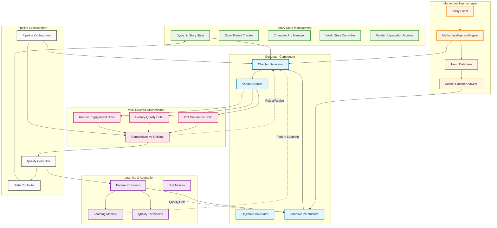
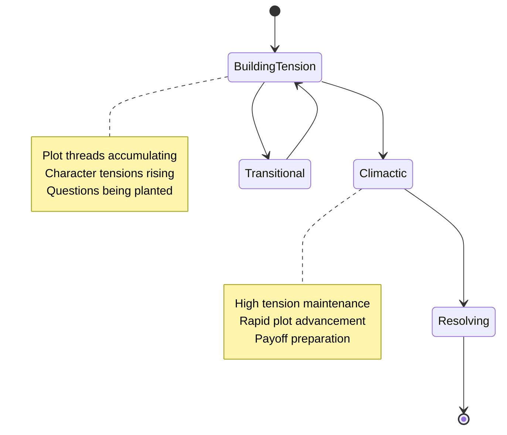
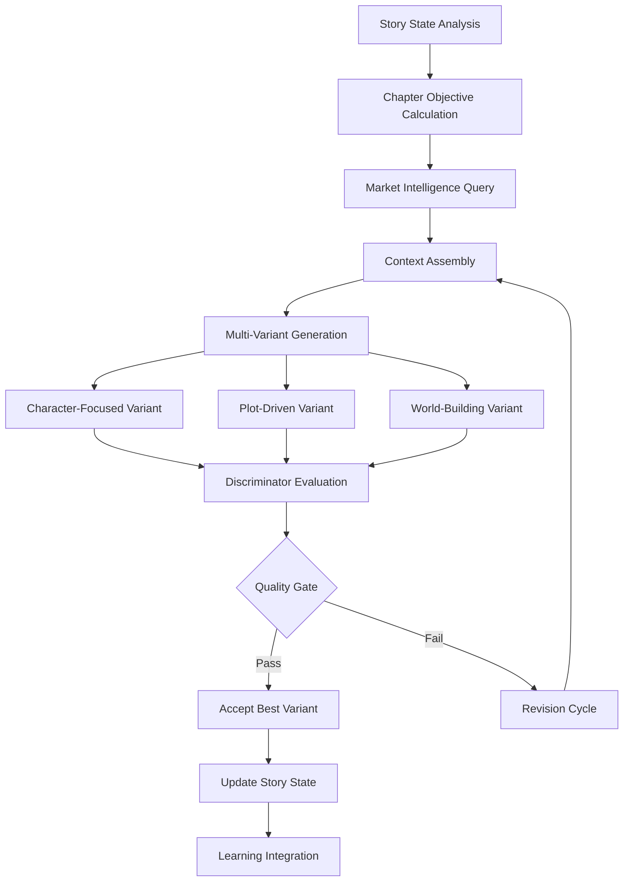
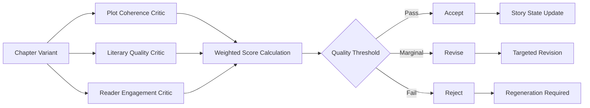
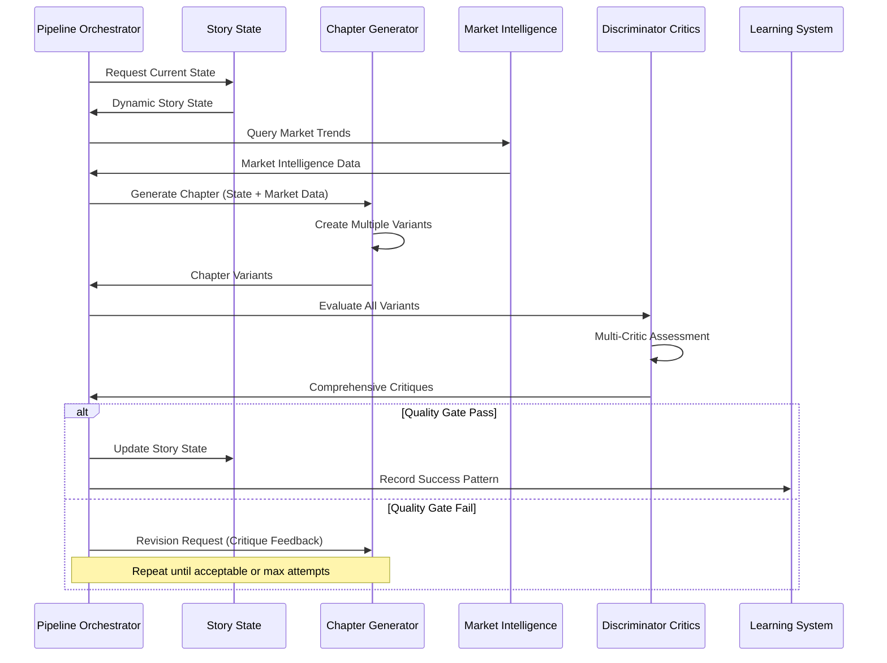

# GAN-Style Adversarial Architecture for Book Writing Pipeline

## Executive Summary

This document defines a novel adversarial architecture for automated book generation, replacing traditional linear pipelines with a Generator-Discriminator model inspired by Generative Adversarial Networks (GANs). The system addresses critical quality issues in current AI-generated literature: repetitive content, shallow character development, formulaic language, and poor pacing through continuous refinement loops and market-driven adaptation.

## Architecture Overview



## Core Components

### 1. Dynamic Story State Management

**Purpose**: Maintain living, evolving context that tracks narrative progression beyond static information injection.

**Key Data Structures**:
- `DynamicStoryState`: Central state container with plot threads, character arcs, world state
- `PlotThread`: Individual story elements with tension tracking and resolution readiness
- `CharacterArc`: Character development with voice consistency and relationship dynamics
- `ReaderExpectations`: Planted questions, promises, and payoff tracking

**State Evolution**:


### 2. Generator Component (Chapter Writer)

**Multi-Phase Generation Process**:

1. **Objective Calculation**: Analyzes current story state to determine chapter mission
2. **Context Assembly**: Builds targeted prompts with market intelligence integration  
3. **Variant Generation**: Creates 2-3 chapter approaches targeting different narrative strategies
4. **Adaptive Learning**: Incorporates critic feedback patterns into generation strategies

**Generation Strategy**:


**Input Data Types**:
- `GenerationContext`: Story state + objectives + market data + constraints
- `ChapterObjective`: Specific goals for plot advancement and character development
- `AdaptiveParameters`: Learning-driven generation settings

**Output Data Types**:
- `ChapterVariant`: Multiple approaches with metadata and objective mapping
- `GenerationMetadata`: Performance data for learning system

### 3. Multi-Layered Discriminator

**Three-Critic Architecture**:

#### Plot Coherence Critic
- **Evaluation Focus**: Story logic, character consistency, plot advancement
- **Key Metrics**: Continuity score, advancement score, logic consistency, tension management
- **Output**: `PlotCoherenceAssessment` with specific inconsistency flags

#### Literary Quality Critic  
- **Evaluation Focus**: Prose quality, originality, character voice, pacing
- **Key Metrics**: Language freshness, voice authenticity, prose quality, cliché detection
- **Output**: `LiteraryQualityAssessment` with improvement suggestions

#### Reader Engagement Critic
- **Evaluation Focus**: Commercial viability, reader satisfaction prediction
- **Key Metrics**: Emotional journey effectiveness, question/answer balance, cliffhanger quality  
- **Output**: `ReaderEngagementAssessment` with market-driven recommendations

**Comprehensive Evaluation**:


### 4. Market Intelligence Integration

**Tavily-Powered Market Research**:

**Query Categories**:
```python
# Weekly market pulse queries
weekly_queries = [
    "bestseller fiction analysis current market trends 2025",
    "book publishing industry reader behavior patterns",
    "fiction writing craft techniques successful authors",
    "literary agents feedback manuscript quality standards"
]

# Genre-specific intelligence  
genre_queries = [
    f"{genre} fiction reader expectations plot pacing 2025",
    f"{genre} bestsellers character development analysis",
    f"{genre} market saturation competition trends",
    f"{genre} reader complaints negative review patterns"
]
```

**Market Data Processing**:
- Real-time trend identification and pattern extraction
- Reader preference analysis and complaint monitoring
- Competitive landscape assessment
- Success factor identification for commercial viability

### 5. Learning and Adaptation System

**Pattern Recognition**:
- Track generator approaches that consistently pass critics
- Identify market-driven success patterns vs. creative innovations
- Monitor for quality drift and convergence on formulaic approaches
- Maintain diversity through novelty injection mechanisms

**Adaptive Mechanisms**:
- **Dynamic Quality Thresholds**: Adjust based on story position (early/middle/climax/resolution)
- **Critic Weight Balancing**: Modify emphasis based on market intelligence updates
- **Creativity Temperature**: Balance between proven patterns and innovative approaches
- **Anti-Convergence**: Inject diversity requirements when output becomes formulaic

## Implementation Architecture

### Data Flow Pipeline



### Quality Control Mechanisms

**Multi-Dimensional Quality Gates**:
- **Story Position Awareness**: Early chapters prioritize setup, middle chapters demand momentum, final chapters require satisfying payoffs
- **Market Viability Scoring**: Commercial appeal weighted against creative innovation
- **Repetition Prevention**: Semantic similarity checking across chapters and scenes
- **Character Voice Validation**: Dialogue and behavior consistency verification

**Quality Threshold Calculation**:
```python
def calculate_dynamic_threshold(story_position: float, genre: str, market_data: MarketIntelligence) -> QualityThresholds:
    base_thresholds = {
        "plot_coherence": 0.7,
        "literary_quality": 0.6, 
        "reader_engagement": 0.8
    }
    
    # Adjust based on story position
    if story_position < 0.25:  # Opening
        base_thresholds["plot_coherence"] += 0.1  # Higher setup requirements
    elif story_position > 0.75:  # Climax/Resolution  
        base_thresholds["reader_engagement"] += 0.15  # Higher payoff demands
        
    # Market-driven adjustments
    for trend in market_data.current_trends:
        if trend.trend_type == "quality_expectations":
            base_thresholds["literary_quality"] += trend.popularity_score * 0.1
            
    return QualityThresholds(**base_thresholds)
```

## Expected Outcomes

### Addressed Quality Issues

**Repetition Elimination**:
- Semantic similarity checking prevents recycled scenes and situations
- Dynamic story state tracking ensures meaningful progression
- Novelty injection maintains creative freshness

**Character Depth Enhancement**:
- Voice consistency validation across all dialogue and internal thoughts
- Relationship dynamic tracking ensures authentic character interactions
- Character arc progression monitoring prevents static personalities

**Pacing Optimization**:
- Momentum scoring identifies and prevents "middle sag" syndrome
- Plot thread density management ensures consistent forward drive
- Reader engagement prediction optimizes chapter-to-chapter flow

**Language Quality Improvement**:
- Cliché detection and replacement suggestions
- Market-informed style adaptation
- Prose quality assessment with specific improvement guidance

### Performance Metrics

**Quality Improvements**:
- Target 70% reduction in repetitive content through semantic analysis
- 85% character voice consistency through validation systems  
- 60% improvement in pacing through momentum tracking
- 50% reduction in formulaic language through cliché detection

**Commercial Viability**:
- Market alignment scoring based on real-time trend analysis
- Reader engagement prediction using successful pattern recognition
- Genre convention adherence with creative differentiation balance

## Technical Implementation Considerations

### Resource Requirements
- Increased computational overhead due to multi-variant generation and multi-critic evaluation
- Tavily API usage for continuous market intelligence gathering
- ChromaDB storage for learning patterns and market data persistence

### Scalability Factors
- Parallel processing potential for multiple chapter variants
- Modular component architecture enabling independent scaling
- Market intelligence caching to reduce API overhead

### Quality Assurance
- Comprehensive unit testing for all Pydantic v2 data models
- Integration testing for adversarial loops and convergence prevention
- Performance monitoring for generation times and quality score distributions

This architecture transforms book generation from a static, template-driven process into a dynamic, market-aware, quality-focused system that learns and adapts while maintaining creative integrity and commercial viability.