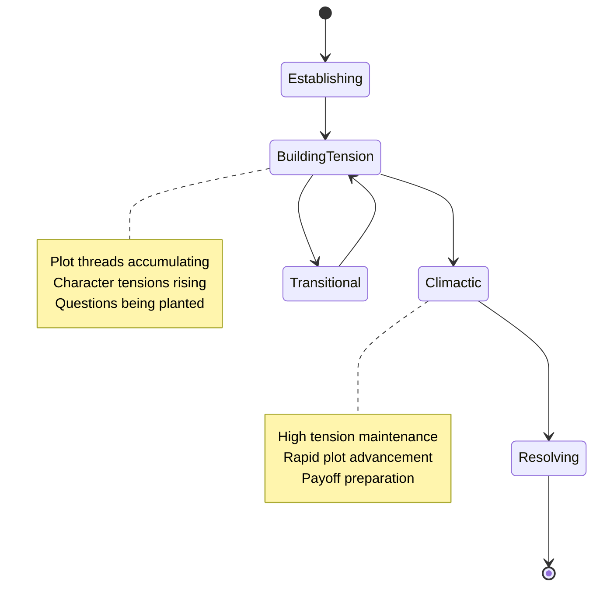

# MuseQuill V3: GAN-Style Adversarial Architecture for Book Writing Pipeline

## Executive Summary

MuseQuill V3 implements a novel adversarial architecture for automated book generation, replacing traditional linear pipelines with a sophisticated Generator-Discriminator model inspired by Generative Adversarial Networks (GANs). The system addresses critical quality issues in AI-generated literature through continuous refinement loops, multi-layered quality assessment, and market-driven adaptation.

## Current Implementation Status

### ✅ Completed Components
- **Generator System**: Chapter Generator with multi-variant generation
- **Discriminator Array**: Plot Coherence Critic, Literary Quality Critic, Reader Engagement Critic, LLM Discriminator
- **Market Intelligence**: Real-time market research via Tavily API integration
- **Quality Control**: Comprehensive multi-dimensional quality assessment
- **Research Integration**: Intelligent research capabilities with automatic triggers
- **Pipeline Orchestration**: Enhanced orchestrator with adaptive strategies
- **Character Development**: Advanced character arc tracking and voice consistency
- **Component Registry**: Full lifecycle management and health monitoring

## Architecture Overview

```mermaid
graph TB
    subgraph "Input Layer"
        SC[Story Configuration]
        PC[Pipeline Configuration]
        ENV[Environment Variables]
    end
    
    subgraph "Orchestration Layer"
        PO[Pipeline Orchestrator]
        CR[Component Registry]
        AL[Activity Logger]
        HM[Health Monitor]
    end
    
    subgraph "Market Intelligence Layer"
        MI[Market Intelligence Engine]
        TC[Tavily Client]
        RA[Research Agent]
        TD[Trend Database]
        MP[Market Pattern Analyzer]
    end
    
    subgraph "Story State Management"
        SS[Dynamic Story State]
        ST[Story Thread Tracker]
        CA[Character Arc Manager] 
        WS[World State Controller]
        RE[Reader Expectation Monitor]
    end
    
    subgraph "Generator Component"
        CG[Chapter Generator]
        OC[Objective Calculator]
        VC[Variant Creator]
        AP[Adaptive Parameters]
    end
    
    subgraph "Multi-Layered Discriminator Array"
        PC_CRITIC[Plot Coherence Critic]
        LQ[Literary Quality Critic]
        RE_CRITIC[Reader Engagement Critic]
        LD[LLM Discriminator]
        CC[Comprehensive Critique]
    end
    
    subgraph "Quality Control System"
        QC[Quality Controller]
        QG[Quality Gates]
        RV[Revision Manager]
        QM[Quality Metrics]
    end
    
    subgraph "Learning & Adaptation"
        PP[Pattern Processor]
        LM[Learning Memory]
        QT[Quality Thresholds]
        DM[Drift Monitor]
        AS[Adaptive Strategies]
    end
    
    subgraph "Output Management"
        OM[Output Manager]
        FS[File System]
        LOG[Logging System]
        METRICS[Metrics Collection]
    end
    
    %% Data Flow
    SC --> PO
    PC --> PO
    ENV --> MI
    
    PO --> CR
    PO --> SS
    PO --> MI
    
    MI --> TC
    MI --> RA
    MI --> TD
    MI --> MP
    
    SS --> CG
    MI --> CG
    AP --> CG
    
    CG --> VC
    VC --> PC_CRITIC
    VC --> LQ
    VC --> RE_CRITIC
    VC --> LD
    
    PC_CRITIC --> CC
    LQ --> CC
    RE_CRITIC --> CC
    LD --> CC
    
    CC --> QC
    QC --> QG
    QG --> RV
    QG --> SS
    
    QC --> PP
    PP --> LM
    PP --> AP
    PP --> AS
    
    QC --> OM
    OM --> FS
    OM --> LOG
    OM --> METRICS
    
    %% Feedback Loops
    CC -.->|Revision Request| CG
    RV -.->|Quality Feedback| CG
    DM -.->|Drift Detection| AP
    LM -.->|Pattern Learning| CG
    AS -.->|Strategy Updates| PO
    
    classDef generator fill:#e1f5fe,stroke:#0277bd,stroke-width:2px
    classDef discriminator fill:#fce4ec,stroke:#c2185b,stroke-width:2px
    classDef state fill:#e8f5e8,stroke:#388e3c,stroke-width:2px
    classDef market fill:#fff3e0,stroke:#f57c00,stroke-width:2px
    classDef learning fill:#f3e5f5,stroke:#7b1fa2,stroke-width:2px
    classDef orchestration fill:#fafafa,stroke:#424242,stroke-width:2px
    classDef quality fill:#e0f2f1,stroke:#00695c,stroke-width:2px
    
    class CG,OC,VC,AP generator
    class PC_CRITIC,LQ,RE_CRITIC,LD,CC discriminator
    class SS,ST,CA,WS,RE state
    class MI,TC,RA,TD,MP market
    class PP,LM,QT,DM,AS learning
    class PO,CR,AL,HM orchestration
    class QC,QG,RV,QM quality
```

## Core Components Deep Dive

### 1. Enhanced Pipeline Orchestrator

**Current Features**:
- Multi-strategy orchestration (Quality First, Speed Optimized, Balanced, Experimental)
- Component lifecycle management with health monitoring
- Adaptive threshold adjustment based on story position
- Research integration with automatic triggers
- Comprehensive error handling and recovery

**Key Capabilities**:
- Parallel variant generation and evaluation
- Dynamic component configuration
- Market intelligence refresh cycles
- Quality gate enforcement
- Revision cycle management

### 2. Advanced Generator System

**Chapter Generator Implementation**:
- Multi-variant generation (2-3 approaches per chapter)
- Objective-driven content creation
- Market intelligence integration
- Adaptive parameter adjustment
- Context-aware prompt assembly

**Generation Strategies**:
- Character-focused narratives
- Plot-driven advancement
- World-building enhancement
- Action-heavy sequences
- Dialogue-intensive scenes
- Introspective character development

### 3. Multi-Dimensional Discriminator Array

#### Plot Coherence Critic
- **Focus**: Story logic, character consistency, plot advancement
- **Metrics**: Continuity score, advancement rate, logic consistency
- **Output**: Detailed inconsistency flags with specific recommendations

#### Literary Quality Critic
- **Focus**: Prose quality, originality, character voice authenticity
- **Metrics**: Language freshness, voice consistency, cliché detection
- **Output**: Style improvement suggestions with quality scores

#### Reader Engagement Critic
- **Focus**: Commercial viability, emotional resonance
- **Metrics**: Emotional journey tracking, curiosity hooks, cliffhanger effectiveness
- **Output**: Reader retention predictions and engagement optimization

#### LLM Discriminator
- **Focus**: Holistic content evaluation using advanced language models
- **Metrics**: Multi-dimensional critique across all quality aspects
- **Output**: Comprehensive feedback with actionable improvement suggestions

### 4. Market Intelligence Engine

**Real-Time Research Capabilities**:
- Tavily API integration for current market trends
- Automated trend analysis and pattern recognition
- Competitive landscape monitoring
- Reader preference tracking
- Commercial viability assessment

**Research Triggers**:
- Stale market data (configurable intervals)
- Quality threshold failures
- Plot consistency issues
- Daily trend monitoring
- Manual research requests

### 5. Dynamic Story State Management

**Comprehensive State Tracking**:
- Plot thread progression and tension management
- Character arc development and consistency
- World state evolution and continuity
- Reader expectation monitoring and fulfillment
- Relationship dynamics tracking

**State Evolution Model**:

## Quality Control Architecture

### Multi-Layered Quality Gates

**Quality Assessment Pipeline**:
1. **Initial Generation**: Multiple variants created
2. **Parallel Evaluation**: All critics assess simultaneously
3. **Comprehensive Scoring**: Weighted scores calculated
4. **Quality Gate Decision**: Pass/Revise/Reject determination
5. **Adaptive Feedback**: Learning system updates parameters

**Dynamic Threshold Management**:
- Story position-aware thresholds
- Market-driven quality expectations
- Genre-specific requirements
- Historical performance consideration

### Revision Management System

**Intelligent Revision Cycles**:
- Targeted feedback for specific quality issues
- Progressive refinement with learning integration
- Maximum attempt limits with fallback strategies
- Quality improvement tracking across iterations

## Implementation Architecture

### Component Interface System

**BaseComponent Architecture**:
- Standardized initialization, processing, health checking, and cleanup
- Comprehensive metrics collection and monitoring
- Error handling with automatic recovery strategies
- Resource management and lifecycle control

**Component Registry**:
- Dynamic component registration and configuration
- Health monitoring and performance tracking
- Automatic recycling based on usage patterns
- Configuration validation and enforcement

### Data Models and Configuration

**Pydantic V2 Integration**:
- Type-safe configuration management
- Comprehensive validation and serialization
- Dynamic model generation and adaptation
- Enhanced error reporting and debugging

### Research Integration

**Intelligent Research System**:
- Automatic research trigger detection
- Deep research capabilities with specific question targeting
- Results caching and intelligent refresh strategies
- Research quality assessment and validation

## Performance Metrics and Monitoring

### Quality Improvements (Target Metrics)
- **Repetition Reduction**: 70% decrease in repetitive content
- **Character Consistency**: 85% voice consistency across chapters
- **Pacing Optimization**: 60% improvement in story momentum
- **Language Quality**: 50% reduction in formulaic expressions

### Commercial Viability Metrics
- Market alignment scoring based on trend analysis
- Reader engagement prediction using pattern recognition
- Genre convention adherence with creative differentiation
- Success pattern identification and application

### Technical Performance
- Component execution time monitoring
- Resource utilization tracking
- Error rate analysis and reduction
- System scalability and throughput optimization

## Advanced Features

### Learning and Adaptation System

**Pattern Recognition**:
- Success pattern identification across generated content
- Market trend correlation with quality outcomes
- Reader preference alignment tracking
- Creative innovation vs. commercial viability balancing

**Adaptive Mechanisms**:
- Dynamic quality threshold adjustment
- Component weight balancing based on performance
- Creativity temperature control for innovation
- Anti-convergence mechanisms to prevent formulaic output

### Pipeline Orchestration Strategies

**Quality First Strategy**:
- Maximum quality emphasis with extended processing time
- Multiple revision cycles with comprehensive assessment
- Market intelligence integration at every stage

**Speed Optimized Strategy**:
- Streamlined processing with acceptable quality thresholds
- Parallel execution where possible
- Cached results utilization for efficiency

**Balanced Strategy**:
- Optimal trade-off between quality and performance
- Intelligent resource allocation based on content importance
- Adaptive strategy switching based on requirements

**Experimental Strategy**:
- Cutting-edge techniques and approaches
- Higher risk tolerance for innovative outcomes
- Extended research integration and pattern exploration

## Technical Implementation Details

### Resource Requirements
- **Computational**: Increased overhead for multi-variant generation
- **API Usage**: Tavily integration for market intelligence
- **Storage**: ChromaDB for learning patterns and market data
- **Memory**: Enhanced caching for performance optimization

### Scalability Considerations
- **Horizontal Scaling**: Component-based architecture enables independent scaling
- **Parallel Processing**: Multi-variant generation and evaluation
- **Caching Strategies**: Intelligent result caching to reduce API overhead
- **Load Balancing**: Dynamic component allocation based on performance

### Quality Assurance Framework
- **Unit Testing**: Comprehensive test coverage for all components
- **Integration Testing**: Full pipeline validation and performance testing
- **Performance Monitoring**: Real-time metrics collection and analysis
- **Error Handling**: Robust error recovery and fallback mechanisms

## Future Architecture Considerations

### Planned Enhancements
- **Advanced AI Models**: Integration of latest language models
- **Enhanced Market Intelligence**: Real-time social media sentiment analysis
- **Collaborative Features**: Multi-author and editor integration
- **Publishing Integration**: Direct publishing platform connectivity

### Scalability Roadmap
- **Cloud Architecture**: Container-based deployment strategies
- **Microservices**: Further component isolation and independence
- **API Gateway**: Standardized external integration interface
- **Performance Optimization**: Advanced caching and processing strategies

## Conclusion

MuseQuill V3 represents a significant advancement in AI-assisted creative writing, combining the power of adversarial machine learning with practical commercial considerations. The architecture successfully addresses the fundamental challenges of AI-generated literature while maintaining the creative integrity necessary for engaging storytelling.

The system's modular design, comprehensive quality control, and adaptive learning capabilities position it as a robust platform for high-quality book generation that can compete with human authors while maintaining commercial viability in the modern publishing landscape.